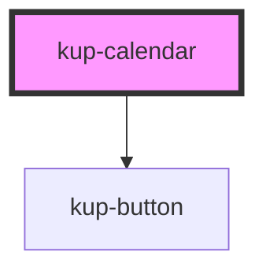

# kup-calendar

<!-- Auto Generated Below -->

## Properties

| Property         | Attribute         | Description | Type        | Default     |
| ---------------- | ----------------- | ----------- | ----------- | ----------- |
| `data`           | --                |             | `DataTable` | `undefined` |
| `dateCol`        | `date-col`        |             | `string`    | `undefined` |
| `descrCol`       | `descr-col`       |             | `string`    | `undefined` |
| `hideNavigation` | `hide-navigation` |             | `boolean`   | `false`     |
| `iconCol`        | `icon-col`        |             | `string`    | `undefined` |
| `initialDate`    | `initial-date`    |             | `string`    | `undefined` |
| `styleCol`       | `style-col`       |             | `string`    | `undefined` |
| `weekView`       | `week-view`       |             | `boolean`   | `false`     |

## Dependencies

### Depends on

- [kup-button](../kup-button)

### Graph

----------------------------------------------

*Built with [StencilJS](https://stenciljs.com/)*
